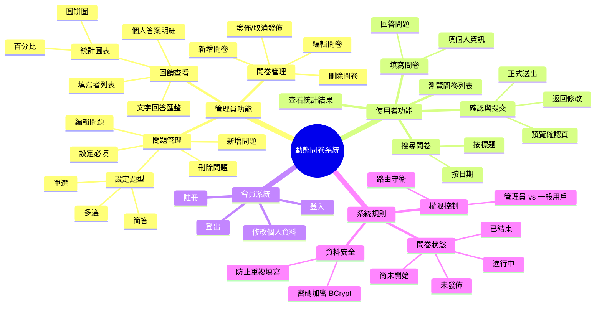
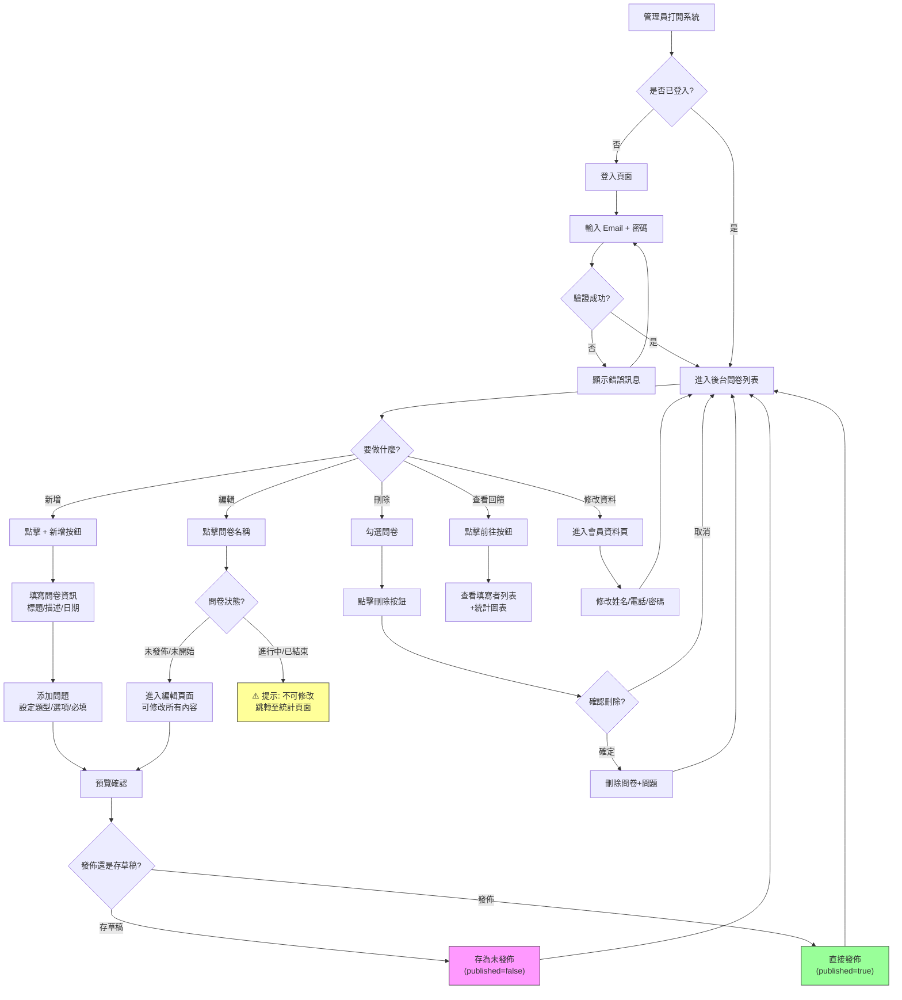
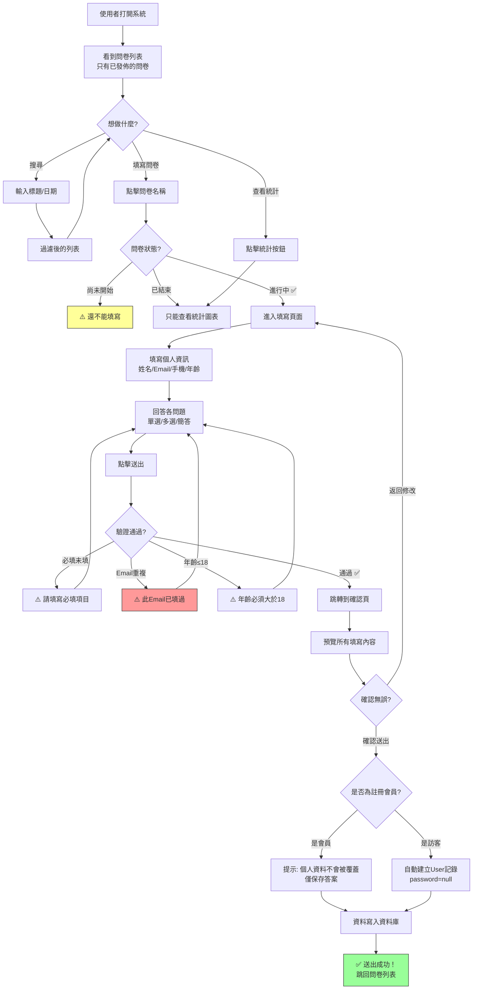
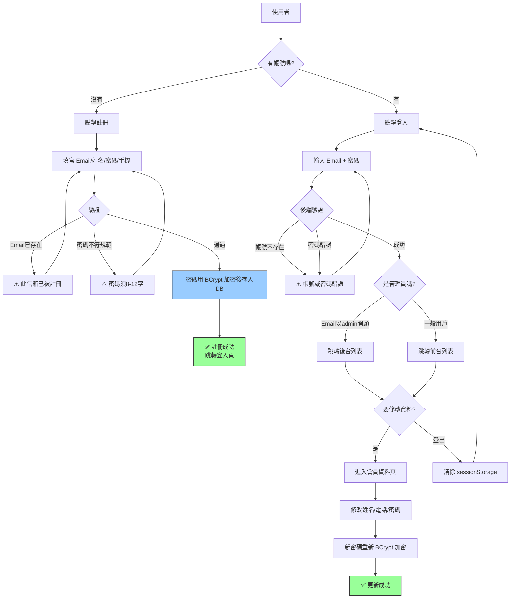
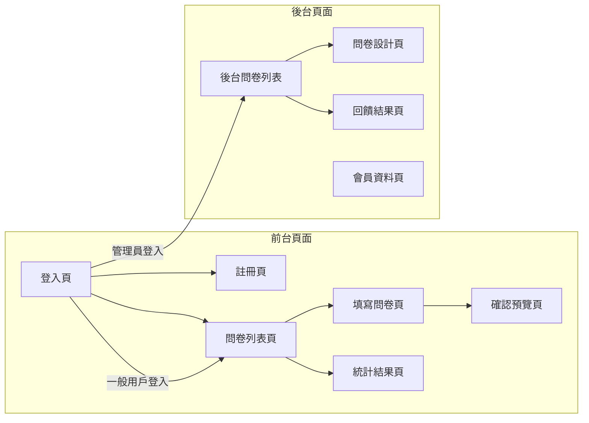

# 📋 動態問卷系統 — PRD（產品需求文檔）

> **版本**：v1.0  
> **日期**：2026-03-09  
> **角色**：這份文檔是「需求分析與產品定義」階段的最終產物，在寫任何代碼之前就應該完成。

---

## 📌 一、產品概述

| 項目 | 說明 |
|------|------|
| **產品名稱** | 動態問卷系統（Dynamic Questionnaire） |
| **類比產品** | Google Forms、SurveyMonkey |
| **目標用戶** | 管理員（建立問卷）、一般使用者/訪客（填寫問卷） |
| **核心價值** | 讓管理員能快速建立各種問卷，使用者能方便填寫，管理員能即時查看統計結果 |

---

## 🧠 二、心智圖（Mind Map）— 梳理業務全貌

> 心智圖的目的：**一張圖看清整個系統有什麼功能**，從中心往外擴散。



---

## 🔄 三、流程圖（Flowchart）— 使用者的操作路徑

### 3.1 管理員的完整操作流程



### 3.2 使用者/訪客的填寫流程



### 3.3 會員系統流程



---

## 🖼️ 四、頁面草稿圖（Wireframe）— 簡單描述每個頁面的區塊

> 草稿圖的目的：讓後端工程師知道「前端要顯示什麼資料」，進而推導出需要什麼 API。

### 4.1 頁面總覽



### 4.2 各頁面佈局與所需資料

---

#### 📄 登入頁 `/login`

```
┌──────────────────────────────────┐
│          動態問卷系統              │
│                                  │
│   ┌────────────────────────┐     │
│   │ 📧 Email               │     │
│   └────────────────────────┘     │
│   ┌────────────────────────┐     │
│   │ 🔒 密碼                │     │
│   └────────────────────────┘     │
│                                  │
│        [ 登入按鈕 ]               │
│                                  │
│   還沒有帳號？ 立即註冊            │
└──────────────────────────────────┘

後端需要提供的 API:
  POST /user/login → { email, password }
  回傳: { code, message, user: {email, name, phone, age} }
```

---

#### 📄 前台問卷列表 `/list`

```
┌──────────────────────────────────────────────┐
│  🔍 搜尋區塊                                  │
│  ┌──────────┐ ┌──────────┐ ┌──────────┐      │
│  │ 標題搜尋  │ │ 開始日期  │ │ 結束日期  │ [搜尋] │
│  └──────────┘ └──────────┘ └──────────┘      │
├──────────────────────────────────────────────┤
│  📋 問卷表格（只顯示已發佈）                     │
│  ┌────┬──────────┬─────────┬────────┬────┐   │
│  │ #  │ 問卷名稱  │ 狀態     │ 時間    │ 操作│   │
│  ├────┼──────────┼─────────┼────────┼────┤   │
│  │ 1  │ 滿意度調查│ 進行中 🟢│ 3/1~3/31│ 填寫│   │
│  │ 2  │ 人氣投票  │ 已結束 🔴│ 1/1~2/28│ 統計│   │
│  │ 3  │ 美食調查  │ 尚未開始🟡│ 4/1~4/30│  — │   │
│  └────┴──────────┴─────────┴────────┴────┘   │
│              [ < 1 2 3 > ] 分頁               │
└──────────────────────────────────────────────┘

後端需要提供的 API:
  GET /quiz/getAll → 取得所有問卷
  回傳: { code, message, quizList: [{id, title, startDate, endDate, published}] }

前端處理: 過濾已發佈 → 計算狀態 → 搜尋 → 分頁
```

---

#### 📄 填寫問卷頁 `/questionnaire/:id`

```
┌──────────────────────────────────────────────┐
│  📝 問卷名稱：滿意度調查                       │
│  📄 描述：請幫我們評分...                      │
├──────────────────────────────────────────────┤
│  👤 個人資訊                                  │
│  ┌──────────┐ ┌──────────┐                   │
│  │ 姓名*     │ │ Email*   │                   │
│  └──────────┘ └──────────┘                   │
│  ┌──────────┐ ┌──────────┐                   │
│  │ 手機*     │ │ 年齡*    │                    │
│  └──────────┘ └──────────┘                   │
├──────────────────────────────────────────────┤
│  ❓ 問題列表                                  │
│                                              │
│  Q1.【單選/必填】您對服務滿意嗎？               │
│     ○ 非常滿意  ○ 滿意  ○ 普通  ○ 不滿意       │
│                                              │
│  Q2.【多選/必填】您經常使用哪些功能？            │
│     ☐ 功能A  ☐ 功能B  ☐ 功能C                 │
│                                              │
│  Q3.【簡答/選填】其他建議                       │
│     ┌──────────────────────────────┐         │
│     │                              │         │
│     └──────────────────────────────┘         │
├──────────────────────────────────────────────┤
│            [ 取消 ]    [ 送出 ]               │
└──────────────────────────────────────────────┘

後端需要提供的 API:
  GET /quiz/get?quizId=1 → 取得問卷基本資訊+問題列表
  回傳: { code, quiz: {id, title, ...}, questionList: [{questionId, question, type, required, options}] }
```

---

#### 📄 確認預覽頁 `/questionnaire/confirm/:id`

```
┌──────────────────────────────────────────────┐
│  ✅ 確認您的填寫內容                           │
├──────────────────────────────────────────────┤
│  👤 姓名：王小明                               │
│  📧 Email：wang@example.com                  │
│  📱 手機：0912345678                          │
│  🎂 年齡：25                                  │
├──────────────────────────────────────────────┤
│  Q1. 您對服務滿意嗎？                          │
│  ➤ 答案：非常滿意                              │
│                                              │
│  Q2. 您經常使用哪些功能？                       │
│  ➤ 答案：功能A ; 功能C                         │
│                                              │
│  Q3. 其他建議                                 │
│  ➤ 答案：希望增加XX功能                        │
├──────────────────────────────────────────────┤
│          [ 返回修改 ]    [ 確認送出 ]           │
└──────────────────────────────────────────────┘

後端需要提供的 API（點「確認送出」時呼叫）:
  POST /quiz/fillin → 提交答案
  請求: { quizId, name, email, phone, age, answerVoList: [{question:{...}, answer, number}] }
```

---

#### 📄 後台問卷列表 `/adminlist`

```
┌──────────────────────────────────────────────────┐
│  🔍 搜尋區 + [ + 新增 ] + [ 🗑️ 刪除 ]             │
├──────────────────────────────────────────────────┤
│  ☐ │ #  │ 問卷名稱   │ 狀態   │ 時間       │ 操作 │
│  ──┼────┼───────────┼───────┼───────────┼──────│
│  ☐ │ 1  │ 滿意度調查 │ 開放中 │ 3/1~3/31  │ 前往 │
│  ☐ │ 2  │ 新問卷草稿 │ 未發佈 │ —         │ 前往 │
│  ☐ │ 3  │ 人氣投票   │ 已關閉 │ 1/1~2/28  │ 前往 │
├──────────────────────────────────────────────────┤
│ 點名稱 → 可編輯(未發佈/未開始) 或 查看(進行中/已結束) │
│ 勾選 + 刪除按鈕 → 批次刪除(僅限未發佈/未開始)        │
└──────────────────────────────────────────────────┘
```

---

#### 📄 問卷設計頁 `/adminlist/design`

```
┌──────────────────────────────────────────────┐
│  📑 三步驟頁籤: [問卷資訊] [問題設計] [預覽確認] │
├──────────────────────────────────────────────┤
│ Step 1: 問卷資訊                              │
│  ┌──────────────────────────────┐            │
│  │ 問卷標題*                     │            │
│  └──────────────────────────────┘            │
│  ┌──────────────────────────────┐            │
│  │ 問卷描述*                     │            │
│  └──────────────────────────────┘            │
│  ┌──────────┐  ┌──────────┐                  │
│  │ 開始日期  │  │ 結束日期  │                  │
│  └──────────┘  └──────────┘                  │
│              [ 下一步 ]                       │
├──────────────────────────────────────────────┤
│ Step 2: 問題設計          [ + 新增問題 ]       │
│  ┌──────────────────────────────────────┐    │
│  │ Q1. 您對服務滿意嗎？ [單選][必填] [編輯][刪除]│    │
│  │ Q2. 使用哪些功能？   [多選][選填] [編輯][刪除]│    │
│  └──────────────────────────────────────┘    │
│            [ 上一步 ]  [ 下一步 ]              │
├──────────────────────────────────────────────┤
│ Step 3: 預覽確認                              │
│  (顯示全部問卷資訊和問題的預覽)                  │
│        [ 存為草稿 ]  [ 發佈 ]                  │
└──────────────────────────────────────────────┘

後端 API:
  新增: POST /quiz/create
  編輯: POST /quiz/update
```

---

#### 📄 回饋結果頁 `/admin/results/:id`

```
┌──────────────────────────────────────────────┐
│  📊 頁籤: [填寫回饋] [統計圖表]                 │
├──────────────────────────────────────────────┤
│ 填寫回饋頁籤:                                  │
│  ┌──────┬──────────┬──────────┬──────┐       │
│  │ 姓名  │ Email    │ 手機      │ 日期  │       │
│  ├──────┼──────────┼──────────┼──────┤       │
│  │ 王小明│ w@x.com  │ 0912...  │ 3/5  │ [詳情] │
│  │ 李大華│ l@x.com  │ 0923...  │ 3/6  │ [詳情] │
│  └──────┴──────────┴──────────┴──────┘       │
│                                              │
│ 點「詳情」→ 展開該使用者的每題回答               │
├──────────────────────────────────────────────┤
│ 統計圖表頁籤:                                  │
│                                              │
│  Q1. 您對服務滿意嗎？                          │
│  ┌──────────┐  非常滿意  60%  ████████████   │
│  │  🥧       │  滿意      25%  ██████         │
│  │ 圓餅圖    │  普通      10%  ███            │
│  │           │  不滿意     5%  ██             │
│  └──────────┘                                │
│                                              │
│  Q3. 其他建議（文字題）                         │
│  • "希望增加XX功能"                            │
│  • "非常好用！"                                │
│  • "建議改善介面"                               │
└──────────────────────────────────────────────┘

後端 API:
  GET /quiz/feedback?quizId=1 → 取得統計資料
  回傳: { code, userVoList: [{username, email, phone, age, fiilindate, answerVoList}] }
```

---

## 🔗 五、API 總覽（需求 → 技術的橋梁）

> 這張表就是**需求分析**和**技術設計**的「翻譯表」。

| 需求（使用者能做什麼） | API 路徑 | 方法 | 由誰實現 |
|----------------------|---------|:----:|:------:|
| 新增問卷+問題 | `/quiz/create` | POST | 後端 |
| 編輯問卷+問題 | `/quiz/update` | POST | 後端 |
| 刪除問卷（批次） | `/quiz/delete` | POST | 後端 |
| 發佈/取消發佈 | `/quiz/update`（published 欄位） | POST | 後端 |
| 獲取所有問卷 | `/quiz/getAll` | GET | 後端 |
| 獲取單個問卷+問題 | `/quiz/get?quizId=` | GET | 後端 |
| 獲取問題列表 | `/quiz/get_QuestionList?quizId=` | GET | 後端 |
| 填寫問卷提交 | `/quiz/fillin` | POST | 後端 |
| 查看統計回饋 | `/quiz/feedback?quizId=` | GET | 後端 |
| 註冊 | `/user/register` | POST | 後端 |
| 登入 | `/user/login` | POST | 後端 |
| 修改會員資料 | `/user/update` | POST | 後端 |
| 檢查是否為會員 | `/user/check_registered` | POST | 後端 |
| 搜尋問卷 | — | — | **前端** |
| 分頁顯示 | — | — | **前端** |
| 問卷狀態判斷 | — | — | **前端** |
| 暫存答案（確認頁） | — | — | **前端** |
| 路由守衛 | — | — | **前端** |

---

## 📝 六、總結：PRD 在開發流程中的位置

```
                        你現在在這裡 ✋
                              ↓
 ┌────────┐   ┌────────┐   ┌────────┐   ┌────────┐   ┌────────┐
 │  需求   │ → │  PRD   │ → │ER Model│ → │  代碼   │ → │  測試   │
 │  收集   │   │ 本文件  │   │ 設計DB │   │  開發   │   │  上線   │
 └────────┘   └────────┘   └────────┘   └────────┘   └────────┘
  "要做什麼"   "怎麼做"     "資料怎麼存"  "寫代碼"     "確認沒bug"

PRD 的價值：
  ✅ 讓所有人（產品經理、設計師、前端、後端）看同一份文件
  ✅ 心智圖 → 不會漏掉功能
  ✅ 流程圖 → 不會漏掉步驟和異常處理
  ✅ 草稿圖 → 後端知道要提供什麼資料
  ✅ API 表 → 前後端約定好各自負責什麼
```
