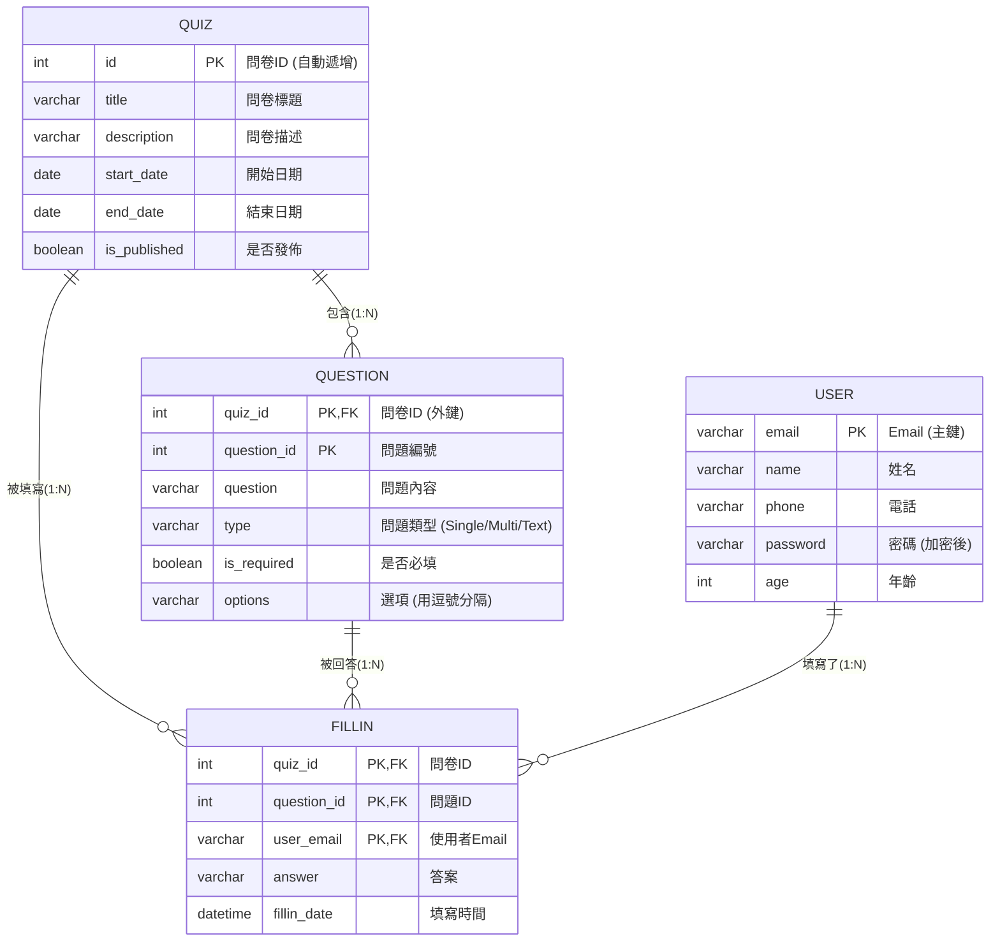

# 🎓 動態問卷系統 — 後端從零到完整代碼教學

> **角色**：我是你的 Java 後端開發課程導師，同時具備架構師和高級工程師的視角。
> 我會用零基礎的方式，帶你一步步理解這個項目是怎麼從「一個想法」演變成「完整後端代碼」的。

---

## 📋 完整後端開發流程總覽

在開始寫任何一行代碼之前，我們先看清楚整個後端開發的「地圖」：

```
Step 1: 需求分析 → 「我們要做什麼？」
Step 2: ER Model 設計 → 「資料長什麼樣？資料之間什麼關係？」
Step 3: 建立資料庫 → 「把 ER Model 變成真正的 MySQL 表格」
Step 4: 初始化 Spring Boot 專案 → 「搭建骨架」
Step 5: Entity 層 → 「用 Java 類別對應資料庫表格」
Step 6: DAO 層 → 「寫 SQL 操作資料庫」
Step 7: Service 層 → 「寫業務邏輯（參數檢查、流程控制）」
Step 8: Controller 層 → 「開放 API 給前端呼叫」
Step 9: 測試與除錯 → 「確保一切正常運作」
```

> [!IMPORTANT]
> **關鍵認知**：後端開發是「自底向上」的過程 —— 從資料庫開始往上建，最終暴露 API 給前端。就像蓋房子：先打地基（資料庫），再建結構（Entity/DAO），再裝修（Service），最後開門迎客（Controller）。

---

## 🔢 Step 1：需求分析 — 「我們到底要做什麼？」

### 1.1 項目背景

我們要做一個 **「動態問卷系統」**，類似 Google Forms。

### 1.2 完整功能需求清單

> [!IMPORTANT]
> 以下是根據「已完成的代碼」整理出的**完整**功能清單，開發前不一定全部想到，但需求分析階段要盡量想得全面。

#### 📦 模組一：問卷管理（後台 — 管理員專用）

| 功能 | 細節說明 | 對應後端方法 |
|------|---------|------------|
| **新增問卷** | 填寫標題、描述、起止日期，一次新增問卷+所有問題 | `QuizService.create()` |
| **編輯問卷** | 修改問卷資訊+問題（智慧更新：自動判斷新增/修改/刪除哪些問題） | `QuizService.update()` |
| **刪除問卷** | 支持**單個刪除**和**批次刪除**（一次刪多份），刪問卷時同時刪除其下所有問題 | `QuizService.delete()` |
| **發佈問卷** | 設定 `is_published = true`，**發佈後且已開始的問卷不可再修改** | 在 `update()` 中檢查 |
| **預覽確認** | 管理員新增/編輯問卷時，送出前可預覽全部問卷資訊與問題，確認無誤再儲存 | 前端 `admindesign` Step 3 |
| **搜尋問卷** | 按標題模糊搜尋 + 日期區間過濾 | 前端 `onSearch()` |
| **分頁顯示** | 每頁 5/10/20/50 筆，避免一次載入太多 | 前端 `MatPaginator` |

> 💡 **編輯的條件限制（非常重要的業務規則）**：
> - ✅ **未發佈** → 可以自由編輯
> - ✅ **已發佈但尚未開始**（開始日期在未來）→ 可以編輯
> - ❌ **已發佈且已開始或已結束** → **禁止修改**（因為可能已有人填寫了）

#### 📝 模組二：問題管理（後台 — 隸屬於問卷管理的子功能）

| 功能 | 細節說明 |
|------|---------|
| **問題類型** | 三種：`Single`（單選）、`Multi`（多選）、`Text`（簡答/文字） |
| **必填設定** | 每個問題可以設定 `is_required`，為 true 時填寫者必須回答 |
| **選項管理** | 單選/多選題必須有選項（用`;`分號分隔儲存在一個字串中），簡答題不需要選項 |
| **自動編號** | 新增時 `question_id` 由系統自動遞增（從 1 開始），不需要前端手動指定 |
| **智慧更新** | 編輯問卷時，系統會比較「舊問題列表」和「新問題列表」，自動判斷哪些要新增、哪些要修改、哪些要刪除（Diff Update） |

#### 🌐 模組三：問卷狀態系統（核心！影響前台和後台的行為）

> [!IMPORTANT]
> **問卷有 4 種狀態**，由 `is_published` 和 `日期` 兩個維度共同決定：

| 狀態 | is_published | 日期條件 | 前台能看到嗎？ | 前台能填寫嗎？ | 後台能修改嗎？ | 後台能刪除嗎？ |
|------|:------:|----------|:------:|:------:|:------:|:------:|
| **未發佈** `unpublished` | `false` | — | ❌ 不顯示 | ❌ | ✅ 可修改 | ✅ 可刪除 |
| **尚未開始** `not_started` | `true` | 今天 < 開始日期 | ✅ 顯示 | ❌ 不能填 | ✅ 可修改 | ✅ 可刪除 |
| **進行中** `in_progress` | `true` | 開始日期 ≤ 今天 ≤ 結束日期 | ✅ 顯示 | ✅ 可填 | ❌ 禁止修改 | ❌ 禁止刪除 |
| **已結束** `finished` | `true` | 今天 > 結束日期 | ✅ 顯示 | ❌ 不能填 | ❌ 禁止修改 | ❌ 禁止刪除 |

```
                         is_published?
                        /            \
                     false            true
                      |                |
                   未發佈          日期判斷
                (不顯示在         /    |    \
                 前台列表)    今天<start  start≤今天≤end  今天>end
                              |           |              |
                           尚未開始      進行中         已結束
                          (可改不可填)  (可填不可改)   (不可填不可改)
```

#### 📋 模組四：前台功能（使用者/訪客）

| 功能 | 細節說明 | 對應代碼 |
|------|---------|---------|
| **瀏覽問卷列表** | 前台只顯示 **已發佈** 的問卷 | `list.component` 過濾 `published === true` |
| **填寫問卷** | 填寫個人資訊（姓名、Email、手機、年齡）+ 動態問題的答案 | `questionnaire-fill.component` |
| **暫存答案** | 填寫後先暫存到 `sessionStorage`，跳轉到確認頁，**不會直接提交** | `setTempAnswer()` |
| **確認頁預覽** | 使用者可以檢查所有填寫內容，確認無誤再送出 | `questionnaire-confirm.component` |
| **返回修改** | 從確認頁返回填寫頁，之前填的資料會帶回來（不會消失） | 靠 `getTempAnswer()` |
| **正式提交** | 確認後才真正把答案寫入資料庫 | `FillinService.fillin()` |
| **防止重複填寫** | 同一個 Email 不能對同一份問卷重複提交 | `fillinDao.existsByQuizIdAndUserEmail()` |
| **必填驗證** | 標記為必填的問題，答案不能為空 | `FillinService.checkParams()` |
| **年齡限制** | 年齡必須大於 18 才能填寫 | `checkParams()` 中檢查 |
| **查看統計結果** | **進行中**或**已結束**的問卷，任何人都可查看圓餅圖統計和文字回答 | `statistic.component` + `GET /quiz/feedback` |
| **搜尋/分頁** | 按標題搜尋、日期過濾、分頁顯示 | 前端 `onSearch()` |

#### 📊 模組五：查看回饋與統計（後台 — 管理員）

| 功能 | 細節說明 | 對應代碼 |
|------|---------|---------|
| **填寫者列表** | 顯示所有填過某問卷的人（姓名、Email、手機、填寫時間） | `FillinService.getAllFillinUsers()` |
| **個人答案明細** | 點擊某位填寫者，查看他每一題的具體回答 | `FillinService.feedback()` |
| **統計圖表** | 單選/多選題用**圓餅圖**呈現各選項的投票比例 | 前端 `Chart.js` |
| **文字回答匯整** | 簡答題列出所有人的文字回答 | 前端 `getTextAnswers()` |

#### 👤 模組六：會員系統（完整的使用者管理）

| 功能 | 細節說明 | 對應代碼 |
|------|---------|---------|
| **註冊** | 填寫 Email、姓名、密碼、手機，密碼用 **BCrypt 加密**後儲存 | `UserService.register()` |
| **登入** | 輸入 Email + 密碼，後端比對加密後的密碼 | `UserService.login()` |
| **登出** | 清除瀏覽器中的登入狀態（sessionStorage） | 前端 `AuthService.logout()` |
| **修改會員資料** | 登入後可修改**姓名、手機、密碼**（新密碼也會重新加密） | `UserService.updateProfile()` |
| **檢查是否為會員** | 判斷某 Email 是否已註冊（有密碼 = 會員，無密碼 = 訪客） | `UserService.checkRegistered()` |
| **Email 重複檢查** | 註冊時檢查 Email 是否已被使用 | `UserDao.getEmailCount()` |
| **密碼安全** | 回傳登入結果時，會把 `password` 設為 `null`，**絕不回傳密碼到前端** | `login()` 中 `user.setPassword(null)` |

> [!WARNING]
> **訪客 vs 會員的區別（重要設計！）**：
> - **訪客**：不需要註冊就能填問卷。填寫時系統自動在 `user` 表建一條記錄，但 `password = null`
> - **會員**：通過註冊頁面建立帳號，`password` 會用 BCrypt 加密儲存
> - **關鍵規則**：如果訪客的 Email 和註冊會員相同，系統**不會覆蓋會員的資料**（保護會員安全）

#### 🛡️ 模組七：權限與安全（跨模組）

| 功能 | 細節說明 |
|------|---------|
| **路由守衛** | 後台頁面（adminlist、admindesign 等）需要登入才能訪問 |
| **管理員判斷** | Email 以 `admin` 開頭 → 視為管理員，可進入後台 |
| **跨域設定** | `@CrossOrigin(origins = "http://localhost:4200")` 允許前端訪問 |
| **全域例外處理** | 統一攔截 `MethodArgumentNotValidException`、`SQLException`、`Exception` |
| **參數驗證** | 使用 `@NotBlank`、`@Min`、`@Valid` 等註解自動驗證請求參數 |
| **事務管理** | 多個 DAO 操作用 `@Transactional` 確保要麼全成功、要麼全失敗 |

### 1.3 核心業務流程（完整版）

```
                        ┌─────────────────────────────────────────┐
                        │              管理員流程                  │
                        ├─────────────────────────────────────────┤
                        │  登入 → 進入後台列表                     │
                        │    ├→ 新增問卷 → 加問題 → 存為草稿/發佈   │
                        │    ├→ 編輯問卷（未發佈/未開始才可改）      │
                        │    ├→ 刪除問卷（批次/單一）               │
                        │    ├→ 查看回饋（填寫者列表 + 統計圖表）    │
                        │    └→ 修改會員資料                       │
                        └─────────────────────────────────────────┘

                        ┌─────────────────────────────────────────┐
                        │              使用者/訪客流程              │
                        ├─────────────────────────────────────────┤
                        │  瀏覽前台列表（只看已發佈的問卷）          │
                        │    ├→ 進行中 → 填寫 → 確認預覽 → 送出     │
                        │    ├→ 已結束 → 只能看統計                 │
                        │    └→ 尚未開始 → 不能點進去                │
                        │                                         │
                        │  可選：註冊帳號 → 登入 → 修改會員資料      │
                        └─────────────────────────────────────────┘
```

### 1.4 從需求提煉出「名詞」（也就是未來的資料表）

> 💡 **技巧**：在需求分析中，把所有**名詞**找出來，它們往往就是你的**資料表（Entity）**。

從上面的需求，我們找到了 4 個核心名詞：

| 名詞 | 說明 | 對應的資料表名稱 |
|------|------|----------------|
| 問卷 | 一份完整的調查表（含標題、描述、日期、發佈狀態） | `quiz` |
| 問題 | 問卷裡的每一道題目（含題型、選項、是否必填） | `question` |
| 填寫紀錄 | 某人對某題的回答 | `fillin` |
| 使用者 | 填寫者/會員（訪客也會自動建立，但密碼為 null） | `user` |

---

## 🗂 Step 2：ER Model 設計 — 「資料之間是什麼關係？」

> [!NOTE]
> **ER Model（Entity-Relationship Model，實體關係模型）** 是資料庫設計的第一步。它用圖形化的方式表達「有哪些資料」以及「資料之間的關係」。

### 2.1 什麼是 ER Model？

ER Model 有三個核心概念：

| 概念 | 符號 | 說明 | 舉例 |
|------|------|------|------|
| **Entity（實體）** | 長方形 □ | 現實世界中可被區分的事物 | 問卷、問題、使用者 |
| **Attribute（屬性）** | 橢圓形 ○ | 實體的特性 | 問卷的`標題`、`描述`、`日期` |
| **Relationship（關係）** | 菱形 ◇ | 實體之間的關聯 | 問卷「包含」問題 |

### 2.2 設計我們系統的 ER Model



### 2.3 逐一分析每個 Entity

---

#### 📌 Entity 1：`Quiz`（問卷）

**思考過程**：一份問卷需要有什麼資訊？

| 屬性 | 資料類型 | 是否主鍵 | 說明 |
|------|---------|---------|------|
| `id` | `int` | ✅ PK (Auto Increment) | 問卷的唯一識別碼，由資料庫自動生成 |
| `title` | `varchar` | | 問卷標題，例如「滿意度調查」 |
| `description` | `varchar` | | 問卷描述 |
| `start_date` | `date` | | 問卷開始日期 |
| `end_date` | `date` | | 問卷結束日期 |
| `is_published` | `boolean` | | 是否已發佈（true/false） |

> 💡 **為什麼 `id` 是自動遞增（Auto Increment）？**
> 因為管理員在前端創建問卷時，**不會手動填 ID**。ID 是系統自動分配的，這樣保證唯一性。

---

#### 📌 Entity 2：`Question`（問題）— 複合主鍵

**思考過程**：一道問題需要什麼資訊？它「屬於」哪個問卷？

| 屬性 | 資料類型 | 是否主鍵 | 說明 |
|------|---------|---------|------|
| `quiz_id` | `int` | ✅ PK + FK | 屬於哪個問卷（外鍵，指向 `quiz.id`） |
| `question_id` | `int` | ✅ PK | 問題在該問卷中的編號（從 1 開始） |
| `question` | `varchar` | | 問題的文字內容 |
| `type` | `varchar` | | 類型：`Single`(單選)、`Multi`(多選)、`Text`(簡答) |
| `is_required` | `boolean` | | 是否必填 |
| `options` | `varchar` | | 選項（如 `"選項A;選項B;選項C"`） |

> [!IMPORTANT]
> **什麼是複合主鍵（Composite Primary Key）？**
>
> `Question` 的主鍵是 **(quiz_id, question_id)** 兩個欄位的組合。
>
> **為什麼不用一個單獨的 `id`？** 因為「問題編號」只在同一份問卷內有意義。
> - 問卷 1 的第 1 題 → `(quiz_id=1, question_id=1)`
> - 問卷 2 的第 1 題 → `(quiz_id=2, question_id=1)`
>
> 這兩個都是「第 1 題」，但屬於不同問卷，所以需要兩個欄位才能完全唯一識別。

---

#### 📌 Entity 3：`Fillin`（填寫紀錄）— 三欄位複合主鍵

**思考過程**：一條填寫紀錄代表「**某人**對**某問卷**的**某問題**的回答」。

| 屬性 | 資料類型 | 是否主鍵 | 說明 |
|------|---------|---------|------|
| `quiz_id` | `int` | ✅ PK + FK | 填的是哪份問卷 |
| `question_id` | `int` | ✅ PK + FK | 填的是哪個問題 |
| `user_email` | `varchar` | ✅ PK + FK | 誰填的（Email） |
| `answer` | `varchar` | | 使用者的答案 |
| `fillin_date` | `datetime` | | 填寫時間 |

> 💡 **為什麼主鍵是三個欄位的組合？**
>
> 因為要保證：**同一個使用者，對同一份問卷的同一個問題，只能有一條答案**。
>
> `(quiz_id=1, question_id=1, user_email="a@b.com")` → 唯一的一條紀錄

---

#### 📌 Entity 4：`User`（使用者）

**思考過程**：系統中的使用者有兩種 — **訪客**（只填問卷）和**會員**（有帳號密碼）。

| 屬性 | 資料類型 | 是否主鍵 | 說明 |
|------|---------|---------|------|
| `email` | `varchar` | ✅ PK | 用 Email 當主鍵（唯一識別） |
| `name` | `varchar` | | 姓名 |
| `phone` | `varchar` | | 電話 |
| `password` | `varchar` | | 密碼（**加密保存**，訪客為 null） |
| `age` | `int` | | 年齡 |

> 💡 **為什麼用 `email` 當主鍵而不是用 `id`？**
>
> 因為在這個系統中，Email 本身就是天然的唯一識別碼。每個人的 Email 不會重複。
> 而且填寫問卷時使用的也是 Email，方便直接關聯。

> [!WARNING]
> **密碼欄位的特殊設計**：
> - **訪客**填寫問卷時，系統會自動幫他在 `user` 表中建一條記錄，但 `password` 設為 `null`
> - **會員**註冊時，`password` 會用 **BCrypt 加密** 後儲存，絕對不能存明文！

---

### 2.4 四個 Entity 之間的關係分析

| 關係 | 類型 | 解釋 |
|------|------|------|
| Quiz → Question | **一對多(1:N)** | 一份問卷可以有很多問題，但一個問題只屬於一份問卷 |
| Quiz → Fillin | **一對多(1:N)** | 一份問卷可以被很多人填寫 |
| Question → Fillin | **一對多(1:N)** | 一個問題可以被很多人回答 |
| User → Fillin | **一對多(1:N)** | 一個使用者可以填寫很多問卷的很多問題 |

用更生活化的方式理解：

```
一份「期末考」(Quiz) 有「10道題目」(Question)
「30位學生」(User) 每個人都交了「一張答案紙」
每張答案紙有「10個答案」(Fillin)
所以 Fillin 表最終會有 30 × 10 = 300 條記錄
```

---

### 2.5 從 ER Model 到實際 SQL 建表

ER Model 設計完成後，就可以在 MySQL 中建立對應的表格：

```sql
-- 1. 建立 Quiz 表（問卷）
CREATE TABLE quiz (
    id INT AUTO_INCREMENT PRIMARY KEY,  -- 自動遞增主鍵
    title VARCHAR(255) NOT NULL,
    description TEXT,
    start_date DATE,
    end_date DATE,
    is_published BOOLEAN DEFAULT false
);

-- 2. 建立 Question 表（問題）- 複合主鍵
CREATE TABLE question (
    quiz_id INT NOT NULL,
    question_id INT NOT NULL,
    question VARCHAR(500) NOT NULL,
    type VARCHAR(20) NOT NULL,       -- 'Single', 'Multi', 'Text'
    is_required BOOLEAN DEFAULT false,
    options VARCHAR(1000),           -- 選項，用分號分隔
    PRIMARY KEY (quiz_id, question_id),  -- 複合主鍵
    FOREIGN KEY (quiz_id) REFERENCES quiz(id)  -- 外鍵
);

-- 3. 建立 User 表（使用者）
CREATE TABLE user (
    email VARCHAR(255) PRIMARY KEY,  -- Email 當主鍵
    name VARCHAR(100),
    phone VARCHAR(20),
    password VARCHAR(255),           -- BCrypt 加密後的密碼
    age INT
);

-- 4. 建立 Fillin 表（填寫紀錄）- 三欄位複合主鍵
CREATE TABLE fillin (
    quiz_id INT NOT NULL,
    question_id INT NOT NULL,
    user_email VARCHAR(255) NOT NULL,
    answer TEXT,
    fillin_date DATETIME,
    PRIMARY KEY (quiz_id, question_id, user_email),  -- 三欄位複合主鍵
    FOREIGN KEY (quiz_id, question_id) REFERENCES question(quiz_id, question_id),
    FOREIGN KEY (user_email) REFERENCES user(email)
);
```

---

## 🏗 Step 3：初始化 Spring Boot 專案 — 「搭建骨架」

### 3.1 技術棧選擇

| 技術 | 用途 | 為什麼選它 |
|------|------|-----------|
| **Spring Boot 4.0** | 後端框架 | Java 生態中最主流的後端框架 |
| **Spring Data JPA** | ORM（物件關係映射） | 用 Java 類別操作資料庫，不用手寫大量 SQL |
| **MySQL** | 關聯式資料庫 | 最常見的開源資料庫 |
| **Gradle** | 構建工具 | 管理依賴、編譯、打包 |
| **Spring Security** | 安全框架 | 密碼加密（BCrypt） |
| **Jakarta Validation** | 資料驗證 | 自動檢查請求參數是否合法 |

### 3.2 專案結構（Package 設計）

```
com.example.quiz_1141121/
├── Quiz1141121Application.java     ← 🚀 程式入口（main 方法）
│
├── entity/          ← 📦 實體層：對應資料庫的表格
│   ├── Quiz.java
│   ├── Question.java
│   ├── QuestionId.java      ← 複合主鍵類別
│   ├── Fillin.java
│   ├── FillinId.java         ← 複合主鍵類別
│   └── User.java
│
├── dao/             ← 🗄️ 資料存取層：執行 SQL
│   ├── QuizDao.java
│   ├── QuestionDao.java
│   ├── FillinDao.java
│   └── UserDao.java
│
├── service/         ← ⚙️ 業務邏輯層：參數檢查 + 流程控制
│   ├── QuizService.java
│   ├── FillinService.java
│   └── UserService.java
│
├── controller/      ← 🌐 控制層：接收前端 HTTP 請求
│   ├── QuizController.java
│   ├── FillinController.java
│   └── UserController.java
│
├── req/             ← 📥 請求 DTO：前端傳來的資料格式
│   ├── CreateReq.java
│   ├── UpdateReq.java
│   ├── DeleteReq.java
│   ├── FillinReq.java
│   ├── LoginReq.java
│   ├── RegisterReq.java
│   └── FeedbackReq.java
│
├── res/             ← 📤 回應 DTO：後端回傳的資料格式
│   ├── BasicRes.java        ← 基礎回應（所有回應的父類別）
│   ├── CreateRes.java
│   ├── UpdateRes.java
│   ├── GetQuizRes.java
│   ├── GetQuestionRes.java
│   ├── GetSingleQuizRes.java
│   ├── LoginRes.java
│   ├── FeedbackRes.java
│   ├── FeedbackUserVo.java
│   └── GetFeedbackUserRes.java
│
├── vo/              ← 📊 Value Object：組合型資料物件
│   └── AnswerVo.java
│
├── constants/       ← 📌 常數定義
│   ├── ReplyMessage.java    ← 回應訊息 enum
│   ├── Type.java            ← 問題類型 enum
│   └── ValidationMsg.java   ← 驗證訊息常數
│
└── exception/       ← ⚠️ 全域例外處理
    └── GlobalExceptionHandler.java
```

> [!TIP]
> **為什麼要分這麼多層（Package）？**
>
> 這叫做 **「分層架構」（Layered Architecture）**，是後端開發的黃金標準：
>
> ```
> 前端 ←→ Controller ←→ Service ←→ DAO ←→ 資料庫
>           (接口)      (邏輯)    (資料)
> ```
>
> 每一層只管自己的事情：
> - **Controller**：只負責接收/回傳 HTTP 請求，不寫業務邏輯
> - **Service**：只負責業務邏輯（驗證、流程），不直接操作資料庫
> - **DAO**：只負責跟資料庫溝通（CRUD），不做業務判斷

### 3.3 設定檔 — `application.properties`

專案建好後，第一件事就是設定**資料庫連線**：

```properties
# 應用名稱
spring.application.name=quiz_1141121

# 資料庫連線設定
# jdbc:mysql://主機:端口/資料庫名?設定參數
spring.datasource.url=jdbc:mysql://localhost:3306/quiz_1141121?serverTimezone=GMT%2B8&useSSL=false&rewriteBatchedStatements=true

# 資料庫帳號密碼
spring.datasource.username=root
spring.datasource.password=123456

# MySQL 驅動程式
spring.datasource.driver-class-name=com.mysql.cj.jdbc.Driver

# 在控制台顯示 SQL 語句（方便 Debug）
spring.jpa.show-sql=true
```

### 3.4 依賴設定 — `build.gradle`

```groovy
dependencies {
    // 🔧 Spring Boot 核心
    implementation 'org.springframework.boot:spring-boot-starter'

    // 🌐 Web 功能（讓這個程式變成一個 Web Server，可以處理 HTTP 請求）
    implementation 'org.springframework.boot:spring-boot-starter-web'

    // 🗄️ JPA（Java Persistence API）— 用 Java 類別操作資料庫
    implementation 'org.springframework.boot:spring-boot-starter-data-jpa'

    // 🐬 MySQL 驅動程式 — 讓 Java 能連接 MySQL
    implementation 'com.mysql:mysql-connector-j'

    // 🔒 安全框架 — 主要用來做密碼加密（BCrypt）
    implementation 'org.springframework.boot:spring-boot-starter-security'

    // ✅ 資料驗證 — @NotBlank, @Min 等註解
    implementation 'org.springframework.boot:spring-boot-starter-validation'
}
```

### 3.5 主程式入口 — `Quiz1141121Application.java`

```java
@SpringBootApplication(exclude = {
    UserDetailsServiceAutoConfiguration.class,
    ServletWebSecurityAutoConfiguration.class
})
public class Quiz1141121Application {
    public static void main(String[] args) {
        SpringApplication.run(Quiz1141121Application.class, args);
    }
}
```

> 💡 **為什麼要 `exclude`？**
>
> 因為我們加入了 `spring-boot-starter-security` 依賴（為了用 BCrypt 加密密碼）。
> 但 Spring Security **預設**會啟用一個登入頁面，要求帳號密碼才能存取 API。
> 我們不需要這個功能，所以用 `exclude` 排除掉預設的安全性設定。

---

## 📜 後續教學預告

以上就是 **Step 1~3** 的完整內容。接下來我們將進入**寫代碼**的階段：

| 步驟 | 內容 | 狀態 |
|------|------|------|
| Step 1: 需求分析 | ✅ 已完成 | 本文件 |
| Step 2: ER Model 設計 | ✅ 已完成 | 本文件 |
| Step 3: 專案初始化 | ✅ 已完成 | 本文件 |
| **Step 4: Entity 層** | 用 Java 類別對應 ER Model | ⏳ 下一篇 |
| **Step 5: DAO 層** | 寫 SQL 存取資料 | ⏳ 下一篇 |
| **Step 6: Service 層** | 寫業務邏輯 | ⏳ 下一篇 |
| **Step 7: Controller 層** | 開放 API 給前端 | ⏳ 下一篇 |

> 當你準備好了，跟我說「繼續」，我會帶你進入 **Step 4: Entity 層** — 把 ER Model 變成 Java 代碼！
